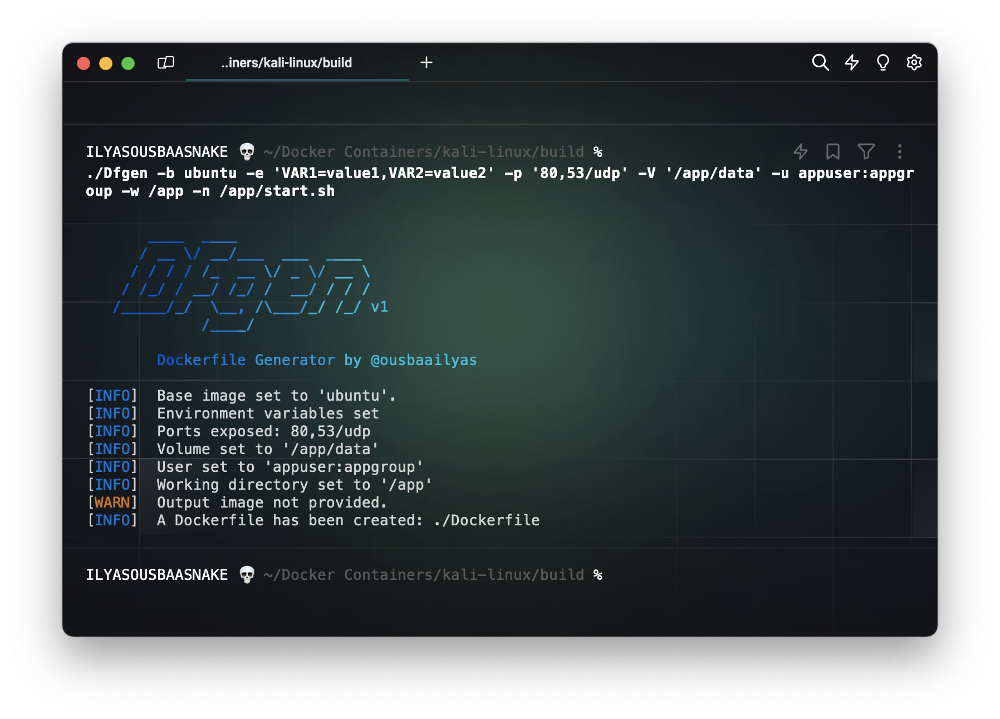

# Dfgen - Dockerfile Generator



**Dockerfile Generator by @ousbaailyas**

## Introduction

Dfgen is a powerful Dockerfile generator tool that simplifies the process of creating Dockerfiles for your projects. It provides a convenient command-line interface with various options to customize your Docker image build process.

## Features

- **Base Image:** Specify the base image for your Dockerfile using the `-b` or `--base` option.
- **Environment Variables:** Set environment variables using the `-e` or `--env` option.
- **Build Arguments:** Define build arguments with the `-a` or `--arg` option.
- **Labels:** Add labels to your Docker image using the `-l` or `--label` option.
- **Exposed Ports:** Expose ports with the `-p` or `--port` option.
- **Volumes:** Set volumes using the `-V` or `--volume` option.
- **User:** Define the user and group with the `-u` or `--user` option.
- **Working Directory:** Set the working directory using the `-w` or `--workdir` option.
- **Entrypoint:** Specify the entrypoint with the `-n` or `--entry` option.
- **Healthcheck:** Set healthcheck command and options with the `-H` or `--health` option.
- **Run Commands:** Execute commands during the build process with the `-r` or `--run` option.
- **Copy Instruction:** Use the `-c` or `--copy` option to set the copy instruction.
- **Add Instruction:** Use the `-A` or `--add` option to set the add instruction.
- **Shell Instruction:** Set shell instructions using the `-s` or `--shell` option.
- **Stop Signal:** Specify the stop signal with the `-S` or `--stopsig` option.
- **Build Image:** Build a new Docker image and set its name using the `-o` option.

## Usage

```bash
./Dfgen [OPTIONS]
```

For detailed information about each option, run:

```bash
./Dfgen -h
```

## Examples

```bash
./Dfgen -b ubuntu:20.04 -e VAR1=value1,VAR2=value2 -p 80,8080/tcp -V /app/data -u appuser:appgroup -w /app -n /app/start.sh
```

## Dockerfile Instructions Menu

Running the script with no options will prompt a menu of Dockerfile instructions to choose from.

## Additional References

- [Docker Documentation](https://docs.docker.com/)
- [Dockerfile Best Practices](https://docs.docker.com/develop/develop-images/dockerfile_best-practices/)
- [Docker Health Check](https://docs.docker.com/engine/reference/builder/#healthcheck)

## Version

To display the Dfgen version, use the following command:

```bash
./Dfgen -v
```

Feel free to explore the options and create customized Dockerfiles effortlessly with Dfgen!
